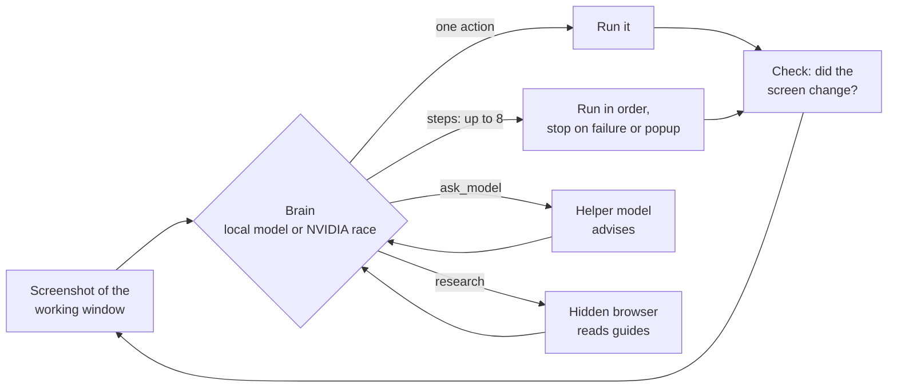

<p align="center">
  
</p>

<h1 align="center">IO</h1>

<p align="center">
  <b>A desktop agent for Windows that runs on your own GPU.</b><br>
  Tell it what to do in plain language. It opens apps, clicks, types, browses and plays games, and it can keep going for hours.
</p>

<p align="center">
  
  
  
  
</p>

---

IO (named after Jupiter's moon) is a local assistant that operates your PC the way a person would. A local model
(Muse Glimmer 30B) plans and decides, EvoCUA-8B finds things on screen, and
[Windows-MCP](https://github.com/CursorTouch/Windows-MCP) reads the accessibility tree so most clicks land on real
controls instead of guessed pixels. If you have a key, the Effort setting lets a stronger brain on NVIDIA's free API
take over hard tasks or all of them, while the local models stay on as eyes and as the fallback.

## Highlights

- **Chat like you would with Claude.** Each message runs as a task with a live checklist, and it remembers the
  conversation, the actions it took and any images you attached.
- **Loops that run until you say stop.** "Play Idle Obelisk Miner until I tell you to stop" locks onto that window
  and keeps acting, researching and writing itself playbooks it reuses on later runs.
- **Several actions per decision.** The `steps` tool lets the brain send up to 8 actions in one turn (tap, tap,
  wait, tap). The rest of a batch is skipped if a step fails or a popup appears.
- **Taps it can verify.** In a loop, every tap compares the window before and after, so the brain is told when a
  tap did nothing instead of assuming it worked.
- **Models as tools.** With `ask_model`, the brain consults another model, picked from a list of what each one
  is good at and how fast it has been lately. Nothing about that choice is hardcoded.
- **Race mode.** A step can go to up to 5 NVIDIA models at once; the first good answer wins.
- **87 actions with self-checks**, grouped by job (apps, controls, files, web, games, PC info), plus one-click
  MCP plugins (web search, documents, Obsidian, GitHub, SQLite and more) and your own skills.
- **Schedules and triggers.** Run tasks every N minutes, daily, when a file lands in a folder, or from
  `POST /api/hook/<name>`.
- **Code against what's really installed.** A model remembers a library's API from whatever version it trained on.
  `api_lookup` reads the real one from the installed files (a .NET project, dll or NuGet package, or a Python module),
  and a failed build lists each error once with the library's real API for the names it couldn't find.
- **A workshop for its own tools.** When a task needs an ability none of IO's tools give, IO asks in Approvals whether
  it may build one. It writes and tests the tool in its own workshop folder (its program files are read-only to it),
  and asks again before turning it on. Customize > Workshop lists what it built.
- **Safe by default.** Deleting files, killing processes and other risky actions wait for your OK.
  **Ctrl+Alt+End** stops everything.

## How a step works



Every action, whether it arrives alone or inside a batch, goes through the same checks: what you told it not to
do, actions turned off in Settings, risky-action confirmation, and in loops, clicks that must stay inside the
locked window.

## Models

Two local models run all the time, side by side on llama.cpp (Unsloth Studio's build): **Muse Glimmer 30B**
(3-bit GGUF, text only) thinks and calls tools, and **EvoCUA-8B**, Meituan's computer-use model, sees and clicks.
Glimmer reads EvoCUA's descriptions of pictures.

How hard IO works is one setting, **Effort**. Pick it in Settings, or for a single message when you send it.
Changing it reloads nothing: every level uses the same two local models.

| Effort | Who decides | Reasoning | What it does |
| --- | --- | --- | --- |
| **Low** | Muse Glimmer, on your PC | Low | Nothing leaves the PC. Quickest |
| **Medium** | Muse Glimmer; hard tasks and goals go to NVIDIA's models | Medium | Tasks that need a stronger brain start on NVIDIA's, and a local run that keeps failing hands over to it |
| **High** | NVIDIA's models | High | More steps, and a second look at the work before the answer |
| **Max** | NVIDIA's models | Max | High, plus Ultracode: the brain can split a task among helpers that work on its parts at once |

**NVIDIA models:** paste an NVIDIA API key in Settings and choose the models (GLM-5.3 Flash, Kimi K3,
Nemotron 3 Nano Omni, Llama 3.2 90B Vision and others; Settings can test any model in NVIDIA's catalog). IO goes
round them in order, skips ones that are failing or slow, and falls back to the local model if none answers.
Without a key, every task runs at Low.

## Using it

IO installs as a normal per-user app: open it from the Start menu, pin it to the taskbar, or turn on
**Start with Windows** in the tray menu. Closing the window keeps it in the tray, so queued and scheduled tasks keep
running. On start it runs `start-balanced-server.cmd` to load the two local models if they aren't up yet.

The panel is also served at http://127.0.0.1:8765, so other programs can queue work:

```bash
curl -X POST http://127.0.0.1:8765/api/tasks -H "Content-Type: application/json" -d "{\"task\": \"open notepad and type hello\"}"
```

**Shortcuts:** Ctrl+Alt+Q opens a new chat, Ctrl+Alt+End stops everything.

### Use your own Chrome (optional)

By default IO browses in a separate Edge window. To use your Chrome instead, with IO's tabs in a tab group named IO:

1. Open `chrome://extensions`, turn on Developer mode, click **Load unpacked** and choose `chrome-extension/`
   (Settings > Browser has an "Open extension folder" button).
2. Click IO's icon in Chrome, copy its token, and paste it in Settings > Browser with "Your Chrome" selected.
3. Press **Test**. A tab opens in a group called IO.

### An iPhone for IO (optional)

IO can use the iOS Simulator on a Mac as its own iPhone: it opens apps and links, looks at the screen, and taps,
types and swipes there (phone_open, phone_look, phone_tap, phone_type, phone_swipe, phone_home), with nothing on any
monitor. It reaches the Mac over SSH (Tailscale works anywhere); EvoCUA finds what to tap on the simulator's screenshot.

1. On the Mac: install Xcode (with the iOS simulator) and turn on System Settings > General > Sharing > Remote Login.
2. Add IO's SSH public key to the Mac's `~/.ssh/authorized_keys`, and put Meta's
   [idb](https://fbidb.io) companion and client on it (`~/io-tools`; no Homebrew needed).
3. Tell IO where it is in `data/iphone.json`: `{"host": "...", "user": "...", "key": "C:/Users/you/.ssh/io_mac", "udid": "<simulator udid>"}`
   (`xcrun simctl list devices` shows the udids).

Then ask for anything "on the iPhone" or "in the simulator".

### Use IO from your phone (optional)

IO can be an app on your phone: chat with it, watch runs and goals, and answer approvals from anywhere. It goes
through [Tailscale](https://tailscale.com), your own private network, so nothing is opened to the internet.

1. Install Tailscale on the PC and on your phone, and sign in to both with the same account.
2. In IO's **Settings > Remote**, turn on remote access and press **Set up**. IO shows your PC's private address.
3. Open that address on your phone, press **Pair a phone** on the PC, and type the six-digit code it shows.
4. On an iPhone, Share > **Add to Home Screen** makes it a full-screen app.

A paired phone can't change settings, keys or plugins; those stay on the PC, and Settings can remove a phone at any
time. While you use IO from the phone, the PC holds off sleep for 15 minutes. If it does fall asleep, the phone
shows a **Wake** button when you give IO a wake address: a Home Assistant webhook that sends the PC a Wake-on-LAN
packet (the PC must be on Ethernet).

## Setup from scratch

**Needs:** Windows 11, an NVIDIA GPU (both models fit side by side in 24 GB), Node.js,
[uv](https://docs.astral.sh/uv/), and [Unsloth Studio](https://unsloth.ai). IO only uses Studio for its llama.cpp
build (`%USERPROFILE%\.unsloth\llama.cpp`) and the CUDA libraries that come with it; Studio itself doesn't need to
run. The models go in `%USERPROFILE%\models`:

- `Muse-Glimmer-30B-UD-Q3_K_XL.gguf` (thinks)
- `evocua-8b-UD-Q4_K_XL.gguf` and `mmproj-evocua-8b-f16.gguf` (sees and clicks, with its vision part)

`start-balanced-server.cmd` starts them on llama-server: EvoCUA on port 8091 first, then Glimmer on 8090.

```bash
uv venv --python 3.14 .venv
uv pip install --python .venv\Scripts\python.exe -r requirements.txt
cd mcp && npm install && cd ..
.venv\Scripts\pythonw.exe install.py
```

Run these from a normal terminal. A Python installed from inside another packaged app (for example the Claude
desktop app's terminal) lands in that app's private storage, where Windows can't start it from the Start menu, so
`install.py` refuses in that case.

**Without the window:** `.venv\Scripts\python.exe boss.py "open notepad and type hello"`. Every step is logged to
`logs/boss.jsonl`, and the panel's debug timeline shows every model call, screenshot and tool with timings.
`toolcheck.py` (Settings > Tools) tests every tool and both model servers without touching the screen.

| Variable | Default |
| --- | --- |
| `BOSS_URL` / `BOSS_MODEL` | `http://127.0.0.1:8090/v1` / `boss` (Muse Glimmer) |
| `EVO_URL` | `http://127.0.0.1:8091/v1` (EvoCUA) |
| `BOSS_APP_PORT` | `8765` |

## Project layout

| Path | What it is |
| --- | --- |
| `desktop.py` | The app window and tray (frameless, keeps Windows snapping and resizing) |
| `app.py`, `panel.html` | The local web panel and its API |
| `boss.py` | The agent loop: brain, eyes, checks, loops and race mode |
| `actions.py` | The action library, routing and tool catalog |
| `nim.py` | NVIDIA models: pacing, health, tests and strengths |
| `learned.py` | Playbooks IO writes for itself after runs |
| `plugins.py`, `catalog.json` | One-click MCP plugins |
| `workshop.py`, `workshop_host.py` | Tools IO builds for itself: proposals, tests, approvals, and the host that runs each one |
| `tools/apilens/` | Reads a .NET library's public API from its metadata, for `api_lookup` (built on first use) |
| `triggers.py` | Folder and webhook triggers |
| `remote.py`, `static/sw.js` | Phone access: pairing, device tokens, Tailscale, the offline Wake screen |
| `start-balanced-server.cmd` | Starts the two local models on llama-server (Glimmer on 8090, EvoCUA on 8091) |
| `toolcheck.py` | Tests every tool and both model servers without touching the screen |
| `bench/` | Regression benchmark, one cell per effort level |
| `chrome-extension/` | Modified Playwright Extension for driving your Chrome |

## Credits

- EvoCUA by Meituan for screen grounding, and Muse Glimmer for thinking, both run on
  [llama.cpp](https://github.com/ggml-org/llama.cpp).
- `extras/ui-tars-desktop.patch` holds the changes made to
  [UI-TARS-desktop](https://github.com/bytedance/UI-TARS-desktop) back when IO used ByteDance's
  [UI-TARS-1.5](https://github.com/bytedance/UI-TARS) in Unsloth Studio for screen grounding.
- [Windows-MCP](https://github.com/CursorTouch/Windows-MCP) for the accessibility tree and input.
- [Playwright MCP](https://github.com/microsoft/playwright-mcp); `chrome-extension/` is a modified copy of
  Microsoft's Playwright Extension (Apache-2.0), see its NOTICE.
- Vendored in `static/`: Alpine.js (MIT), Lucide (ISC), marked (MIT), DOMPurify (Apache-2.0/MPL), Geist and Lora
  fonts (OFL).
