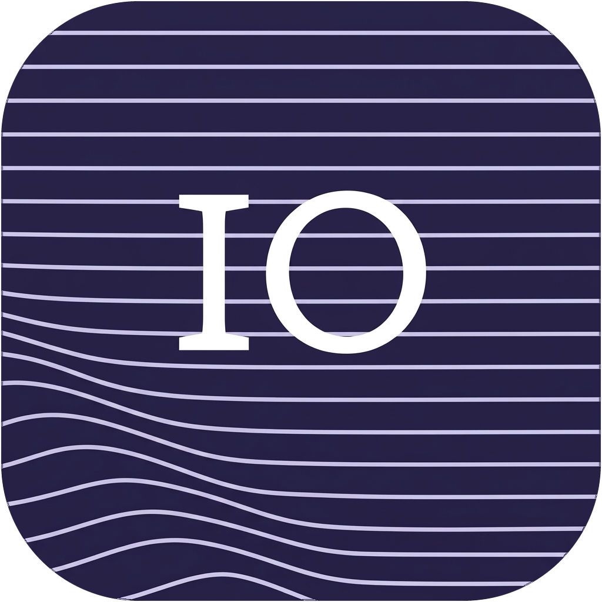
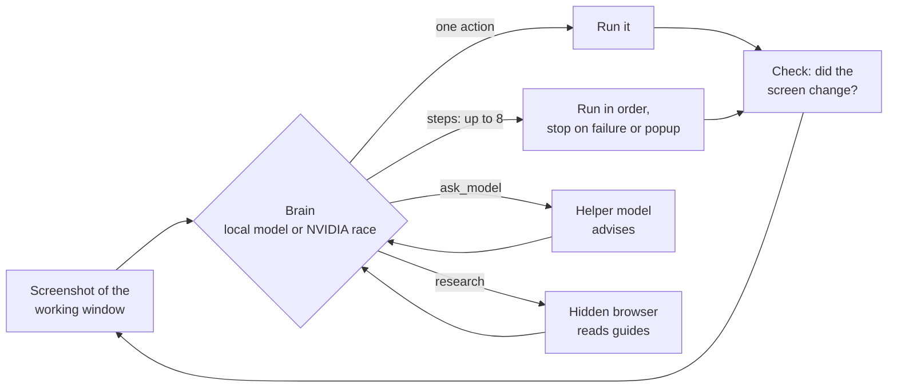

<p align="center">
  
</p>

<h1 align="center">IO</h1>

<p align="center">
  <b>A desktop agent for Windows that runs on your own GPU.</b><br>
  Tell it what to do in plain language. It opens apps, clicks, types, browses and plays games, and it can keep going for hours.
</p>

<p align="center">
  
  
  
  
</p>

---

IO (named after Jupiter's moon) is a local assistant that operates your PC the way a person would. A local model
plans and decides, UI-TARS-1.5 finds things on screen, and [Windows-MCP](https://github.com/CursorTouch/Windows-MCP)
reads the accessibility tree so most clicks land on real controls instead of guessed pixels. If you have a key, a
stronger brain on NVIDIA's free API can take over planning, while the local models stay on as eyes and as the
fallback.

## Highlights

- **Chat like you would with Claude.** Each message runs as a task with a live checklist, and it remembers the
  conversation, the actions it took and any images you attached.
- **Loops that run until you say stop.** "Play Idle Obelisk Miner until I tell you to stop" locks onto that window
  and keeps acting, researching and writing itself playbooks it reuses on later runs.
- **Several actions per decision.** The `steps` tool lets the brain send up to 8 actions in one turn (tap, tap,
  wait, tap). The rest of a batch is skipped if a step fails or a popup appears.
- **Taps it can verify.** In a loop, every tap compares the window before and after, so the brain is told when a
  tap did nothing instead of assuming it worked.
- **Models as tools.** With `ask_model`, the brain consults another model, picked from a list of what each one
  is good at and how fast it has been lately. Nothing about that choice is hardcoded.
- **Race mode.** A step can go to up to 5 NVIDIA models at once; the first good answer wins.
- **87 actions with self-checks**, grouped by job (apps, controls, files, web, games, PC info), plus one-click
  MCP plugins (web search, documents, Obsidian, GitHub, SQLite and more) and your own skills.
- **Schedules and triggers.** Run tasks every N minutes, daily, when a file lands in a folder, or from
  `POST /api/hook/<name>`.
- **Safe by default.** Deleting files, killing processes and other risky actions wait for your OK.
  **Ctrl+Alt+End** stops everything.

## How a step works



Every action, whether it arrives alone or inside a batch, goes through the same checks: what you told it not to
do, actions turned off in Settings, risky-action confirmation, and in loops, clicks that must stay inside the
locked window.

## Models

Pick a mode in Settings. Everything here runs locally through llama.cpp (Unsloth Studio's build).

| Mode | Thinks | Sees and clicks | Notes |
| --- | --- | --- | --- |
| **Fast** | Gemma 4 E4B | UI-TARS-1.5-7B | Quickest |
| **Balanced** | Muse Glimmer 30B (3-bit, text only) | EvoCUA-8B | Meituan's computer-use model clicks; Glimmer reads its descriptions of pictures |
| **Smart** | Qwen 3.8 27B | Qwen 3.8 27B | Strongest local option, several times slower |

**Optional cloud brain:** paste an NVIDIA API key in Settings and choose the models (GLM-5.3 Flash, Kimi K3,
Nemotron 3 Nano Omni, Llama 3.2 90B Vision and others; Settings can test any model in NVIDIA's catalog). IO goes
round them in order, skips ones that are failing or slow, and falls back to the local model if none answers.

## Using it

IO installs as a normal per-user app: open it from the Start menu, pin it to the taskbar, or turn on
**Start with Windows** in the tray menu. Closing the window keeps it in the tray, so queued and scheduled tasks keep
running. On start it launches Unsloth Studio, loads UI-TARS and starts the local model as needed.

The panel is also served at http://127.0.0.1:8765, so other programs can queue work:

```bash
curl -X POST http://127.0.0.1:8765/api/tasks -H "Content-Type: application/json" -d "{\"task\": \"open notepad and type hello\"}"
```

**Shortcuts:** Ctrl+Alt+Q opens a new chat, Ctrl+Alt+End stops everything.

### Use your own Chrome (optional)

By default IO browses in a separate Edge window. To use your Chrome instead, with IO's tabs in a tab group named IO:

1. Open `chrome://extensions`, turn on Developer mode, click **Load unpacked** and choose `chrome-extension/`
   (Settings > Browser has an "Open extension folder" button).
2. Click IO's icon in Chrome, copy its token, and paste it in Settings > Browser with "Your Chrome" selected.
3. Press **Test**. A tab opens in a group called IO.

### Use IO from your phone (optional)

IO can be an app on your phone: chat with it, watch runs and goals, and answer approvals from anywhere. It goes
through [Tailscale](https://tailscale.com), your own private network, so nothing is opened to the internet.

1. Install Tailscale on the PC and on your phone, and sign in to both with the same account.
2. In IO's **Settings > Remote**, turn on remote access and press **Set up**. IO shows your PC's private address.
3. Open that address on your phone, press **Pair a phone** on the PC, and type the six-digit code it shows.
4. On an iPhone, Share > **Add to Home Screen** makes it a full-screen app.

A paired phone can't change settings, keys or plugins; those stay on the PC, and Settings can remove a phone at any
time. While you use IO from the phone, the PC holds off sleep for 15 minutes. If it does fall asleep, the phone
shows a **Wake** button when you give IO a wake address: a Home Assistant webhook that sends the PC a Wake-on-LAN
packet (the PC must be on Ethernet).

## Setup from scratch

**Needs:** Windows 11, an NVIDIA GPU, Node.js, [uv](https://docs.astral.sh/uv/), and
[Unsloth Studio](https://unsloth.ai) with UI-TARS-1.5-7B (Q8_0) and its llama.cpp build. The model for your mode
goes in the Hugging Face cache; the `start-*-server.cmd` scripts show which files each mode expects.

```bash
uv venv --python 3.14 .venv
uv pip install --python .venv\Scripts\python.exe -r requirements.txt
cd mcp && npm install && cd ..
.venv\Scripts\pythonw.exe install.py
```

Run these from a normal terminal. A Python installed from inside another packaged app (for example the Claude
desktop app's terminal) lands in that app's private storage, where Windows can't start it from the Start menu, so
`install.py` refuses in that case.

**Without the window:** `.venv\Scripts\python.exe boss.py "open notepad and type hello"`. Every step is logged to
`logs/boss.jsonl`, and the panel's debug timeline shows every model call, screenshot and tool with timings.
`toolcheck.py` (Settings > Tools) tests every tool without touching the screen.

| Variable | Default |
| --- | --- |
| `BOSS_URL` / `BOSS_MODEL` | `http://127.0.0.1:8090/v1` / `boss` |
| `EYES_URL` / `EYES_MODEL` | `http://127.0.0.1:8888/v1` / `mradermacher/UI-TARS-1.5-7B-GGUF` |
| `STUDIO_API_KEY` | `data/studio.json`, else UI-TARS Desktop's saved settings |
| `BOSS_APP_PORT` | `8765` |

## Project layout

| Path | What it is |
| --- | --- |
| `desktop.py` | The app window and tray (frameless, keeps Windows snapping and resizing) |
| `app.py`, `panel.html` | The local web panel and its API |
| `boss.py` | The agent loop: brain, eyes, checks, loops and race mode |
| `actions.py` | The action library, routing and tool catalog |
| `nim.py` | NVIDIA models: pacing, health, tests and strengths |
| `learned.py` | Playbooks IO writes for itself after runs |
| `plugins.py`, `catalog.json` | One-click MCP plugins |
| `triggers.py` | Folder and webhook triggers |
| `remote.py`, `static/sw.js` | Phone access: pairing, device tokens, Tailscale, the offline Wake screen |
| `bench/` | Regression benchmark |
| `chrome-extension/` | Modified Playwright Extension for driving your Chrome |

## Credits

- [UI-TARS-1.5](https://github.com/bytedance/UI-TARS) by ByteDance for screen grounding.
  `extras/ui-tars-desktop.patch` holds the changes made to
  [UI-TARS-desktop](https://github.com/bytedance/UI-TARS-desktop) while testing it with Unsloth Studio.
- [Windows-MCP](https://github.com/CursorTouch/Windows-MCP) for the accessibility tree and input.
- [Playwright MCP](https://github.com/microsoft/playwright-mcp); `chrome-extension/` is a modified copy of
  Microsoft's Playwright Extension (Apache-2.0), see its NOTICE.
- Vendored in `static/`: Alpine.js (MIT), Lucide (ISC), marked (MIT), DOMPurify (Apache-2.0/MPL), Geist and Lora
  fonts (OFL).
